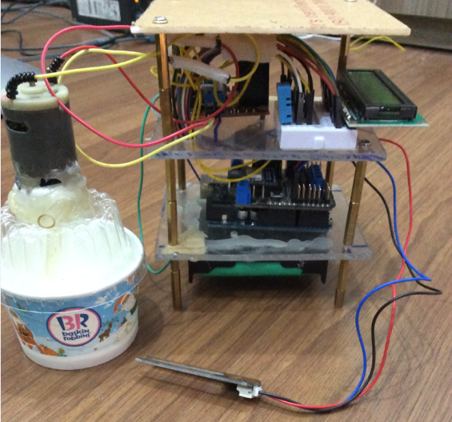
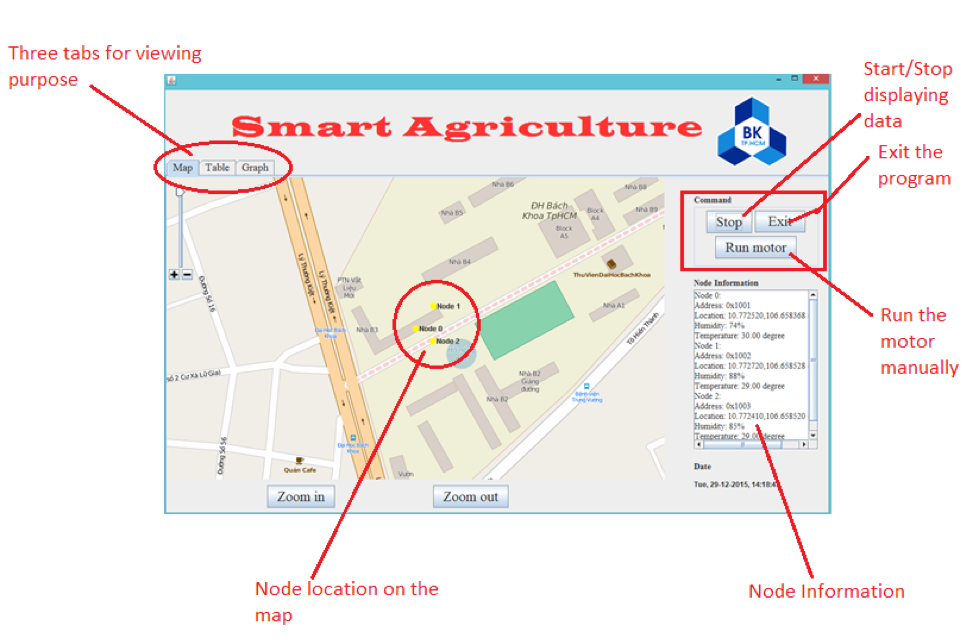
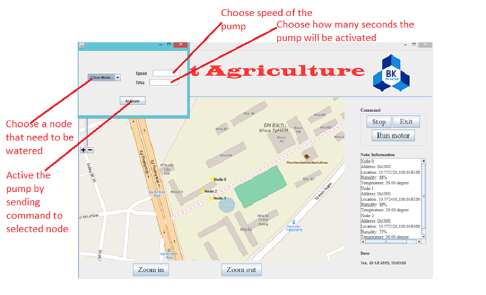
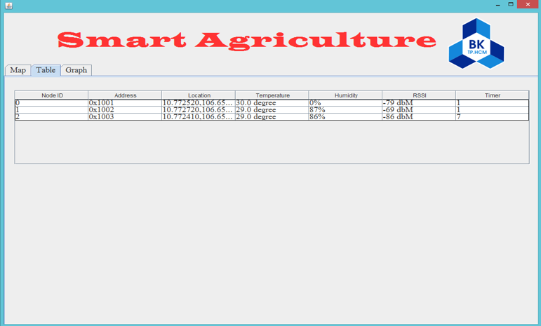
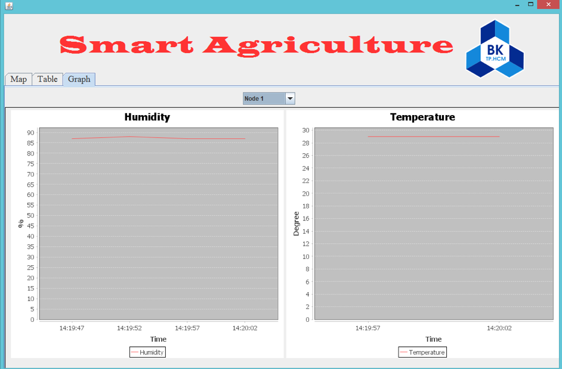
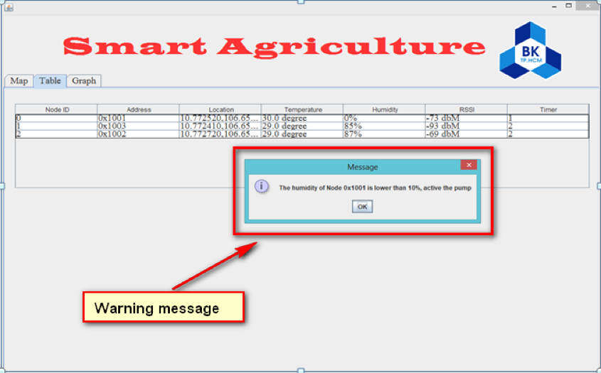
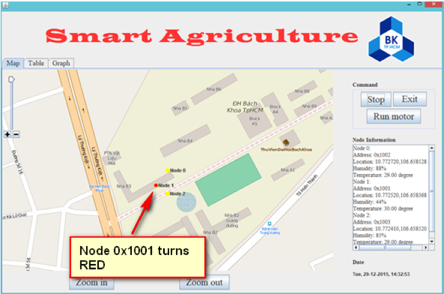
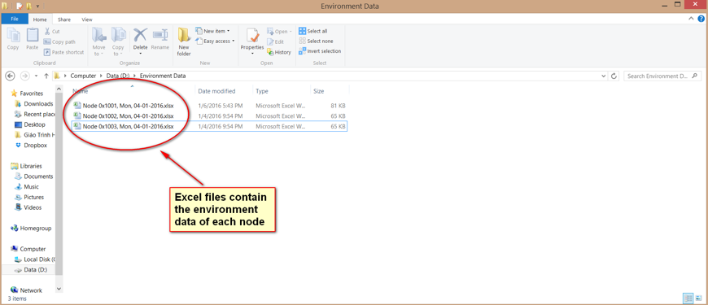
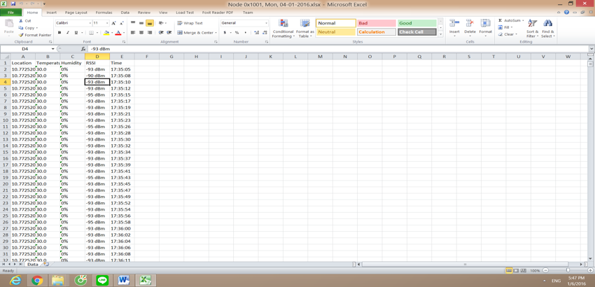

# Smart Agriculture

This is my bachelor thesis project of Ho Chi Minh University of Technology, Telecommunication Major.
This project is an IoT project which implements the ZigBee sensor network for Smart Agriculture.
There are several key features of this project:

+ Nodes outside farm field can send data wirelessly to data center (my laptop app) through ZigBee network (Low-power sensor network for IoT)
+ Data including current temperature outside, soil humidity and location of the nodes
+ Location will be displayed on the application using Open Street Map
+ Humidity and temperature will be displayed on the graph in real-time
+ Water pump attached with each node can be triggered manually or automatically whenever the temperature is too high or the humidity is too low
+ Can detect node failures in order to react promptly
+ Data will be exported to Excel files automatically for analyzing future trends
+ **Note**: If there's a new node, users just need to install the firmware and then the node will automatically connect to the data center (my laptop).

## Technologies

+ Java
+ C (Arduino)
+ ZigBee network
+ Humidity sensor
+ Temperature sensor
+ GPS
+ DC Motor (Water pump)

## Demo

### The design of one node (sorry for the ugly design, but it works)

### Main UI of software (Yellow node means normal condition)

### Panel for activating the pump manually

### Database when the program is running

### Humidity and temperature graph of first node

### When humidity is low, there will be a warning message and the pump will be activated

### Node with the low humidity will be transformed to Red

### Data will be automatically exported to Excel files (Excel file for each node will be created automatically too)

### Content of Excel File

